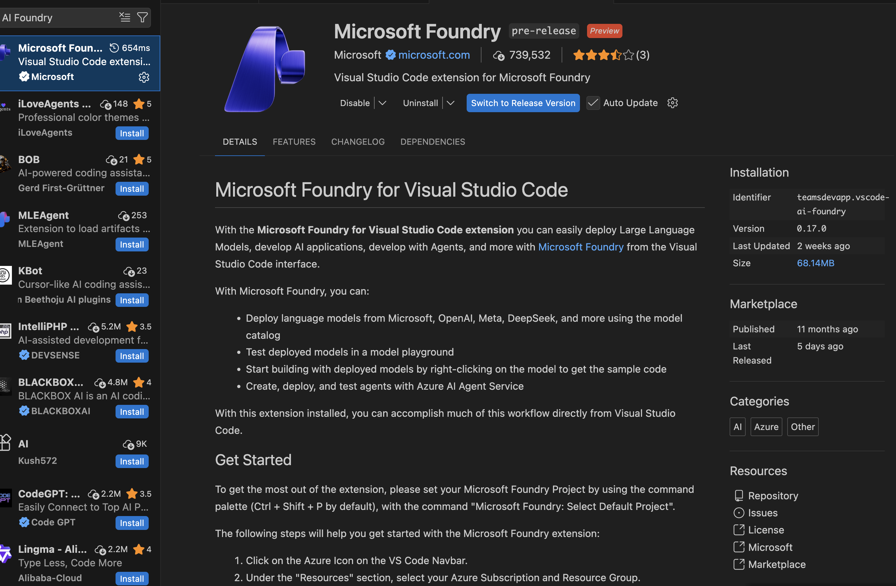

# AI Foundry VS Code extension

The Microsoft Foundry VS Code extension allows you to deploy agents using either the Classic AI foundry portal agents or thw new AI Foundry portal.

## Install the Microsoft Foundry extension

Install the AI foundry extension:

## Types of agents

The current VS code extension is designed to use the new AI Foundry portal.

There are essentially three types of Agent that can be created in AI Foundry new portal experience.

- Prompt Agents via AI foundry Portal. These agents are developed using Foundry SDK. This is an API that exposes clients 
to interact with Foundry Service using primitives that allow you to interact with AI foundry project, and wraps OpenAI APIs to interact with chats, responeses, maintain conversations across sessions.
- Hosted Agents (Preview) - Agents developed locally using Micrsofts new Agent Framework SDK
- Workflow Agents - via AI foundry Portal - Workflows are UI-based tools in Microsoft Foundry. Use them to create declarative, predefined sequences of actions that orchestrate agents and business logic in a visual builder.

Workflows Agents are ideal for scenarios where you need to:

- Orchestrate multiple agents in a repeatable process.
- Add branching logic (for example, if/else) and variable handling without writing code.
- Create human-in-the-loop steps (for example, approvals or clarifying questions).

## Viewing your Foundry resources

Microsoft Foundry resources are encapsulated in Foundry projects.
You can have many foundry projects associated with the MS Foundry.

The Microsoft Foundry extension works with the Azue VS Code extension.
Once you have signed into your Azure tenant/subscription MS Foundry extension can load MS Foundry project.

## Creating a A Classic prompt agents

The focus of this repository is using the new capabilities of the new AI Foundry portal.

If you want to still create Prompt based agents based on the classic UI Portal you can do.

1. Select the Classic icon in the AI Foundry Toolkit vs code extension. 
2. Select Classic agents and click on the + sign
3. This will open a dialog to enter your agent details
4. Enter the name of the agent and any instructions and select an available model
5. Click on the button Create Agent on Microsoft Foundry

This will create the Prompt based agent. Navigate to Microsoft Foundry Portal classic UI. You will find your agent listed.

