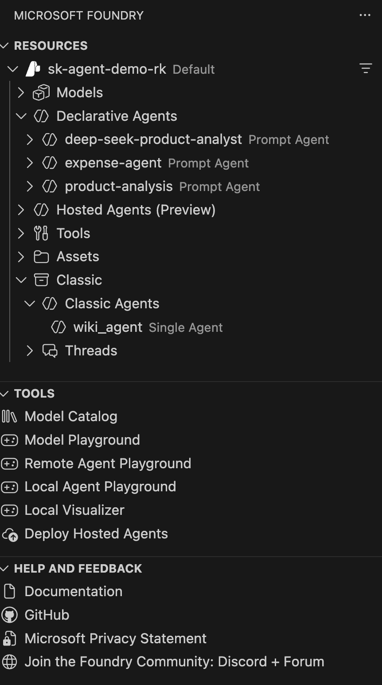

# AI Foundry VS Code extension

The Microsoft Foundry VS Code extension allows you to deploy agents using either the Classic AI foundry portal agents or thw new AI Foundry portal.

## Install the Microsoft Foundry extension

Install the AI foundry extension:

## Types of agents

The current VS code extension is designed to use the new AI Foundry portal.

There are essentially three type of Agent that can be created in AI Foundry new portal experience.

- Prompt Agents
- Hosted Agents (Preview)
- Workflow Agents

## Viewing your Foundry resources

Microsoft Foundry resources are encapsulated in Foundry projects.
You can have many foundry projects associated with the MS Foundry.

The Microsoft Foundry extension works with the Azue VS Code extension.
Once you have signed into your Azure tenant/subscription MS Foundry extension can load MS Foundry project.

## Creating a A Classic prompt agents

